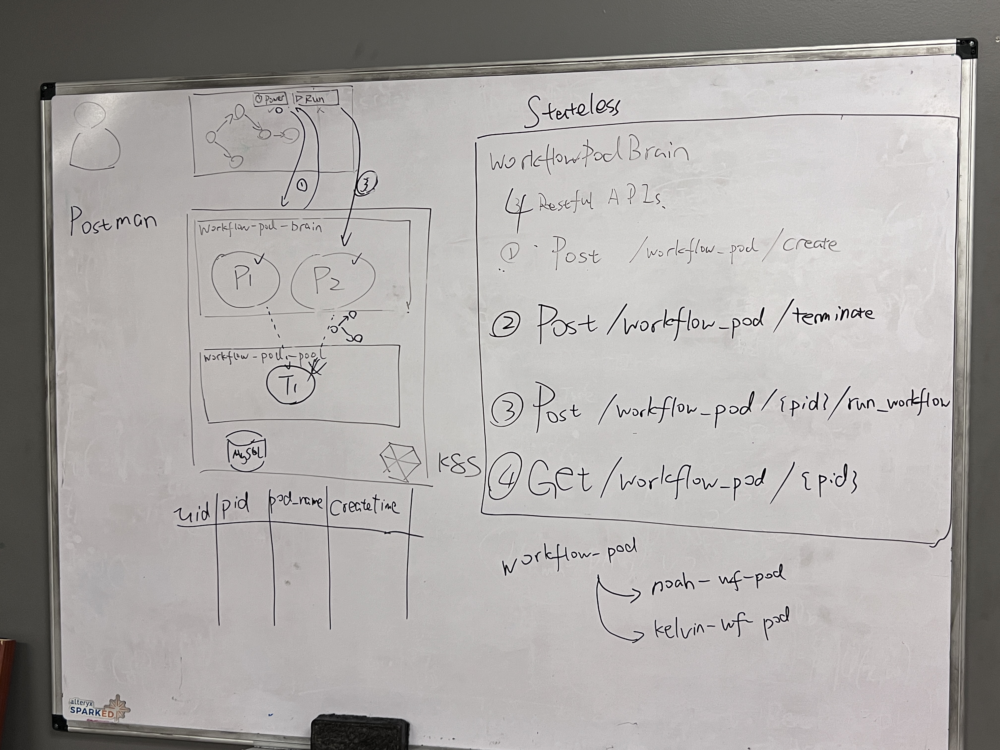

# Workflow Pod Brain

## Architecture

## Structure Overview

### Configuration Files
Under `src/main/resources/`, there are two configuration files:
- application.conf: define the kubernetes config and the mysql connection config
- config.yaml: define the web application's config

All configuration itmes are written by `src/main/scala/config/ApplicationConf.scala`, you can directly use `config` object to access them in the application codes.

### Application codes

All application codes are under `src/main/scala`
- WorkflowPodBrainApplication.scala: the main launcher the of the workflow pod app
- service/KubernetesClientService.scala(TODO): the encapsulation of Kubernetes pod creation/deletion/query logics
- web/
  - model: contains the sql related connection, and classes generated by jooq to manipulate/query tables in DB
  - resources: the RESTful endpoints of the application. `HelloWorldResource` is the hello world endpoint, `WorkflowPodBrainResource`(TODO) are endpoints for workflow-pod related logics

## How to get started

### Dependencies
Similar to texera project, the `Java 11`, `sbt` are required

### Local development setup

Intellij is highly recommended. You can re-use the IDE setup of the texera project.

### Launch the App

To launch the application, build and run `core/workflow-pod-brain/src/main/scala/WorkflowPodBrainApplication.scala`, below is the setup in Intellij:

## How to collaborate

1. Checkout from this branch, `workflow-pod`
2. If you have changes ready to review, submit the PR from `your-dev-branch` to `workflow-pod` through Github. The review is done via Github
3. If `workflow-pod` is updated, Jiadong will send the slack message, and you can update your local `workflow-pod` branch and rebase `your-dev-branch` on top of `workflow-pod`
4. If any changes need to be made in `workflow-pod`, feel free to DM/email Jiadong(jiadongb@uci.edu)